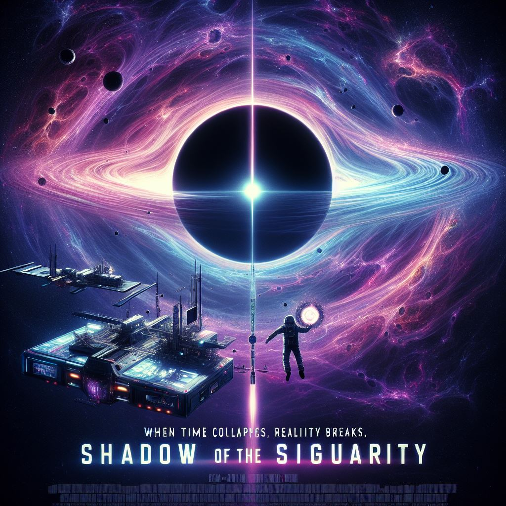
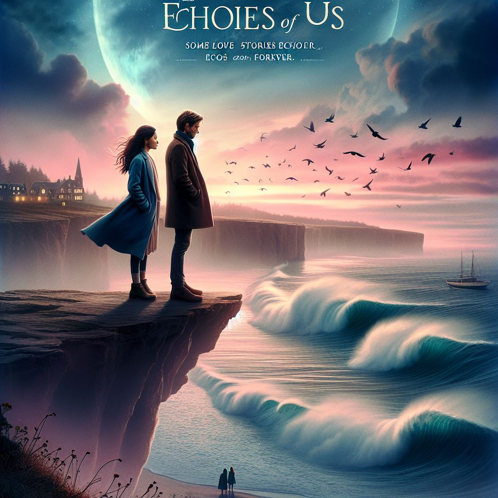
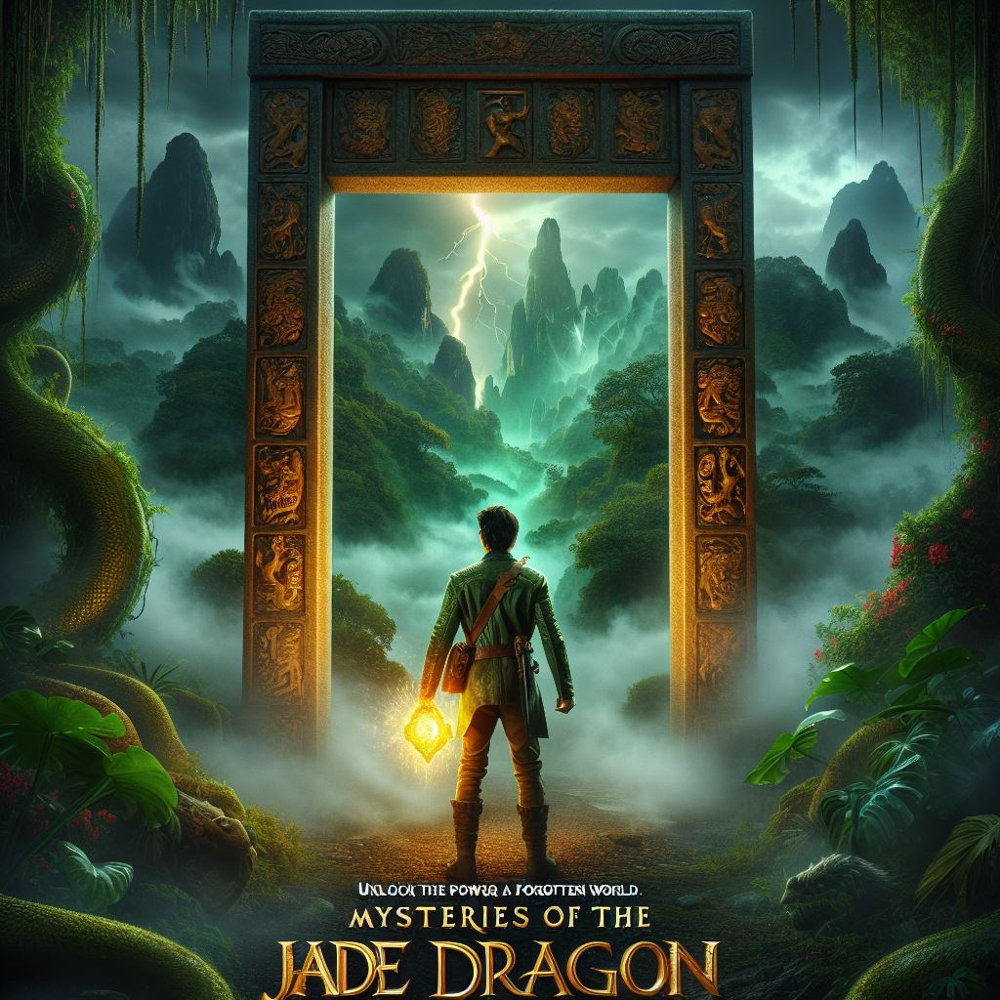

### Prompt

#### Shadow of the Singularity

**Sci-Fi Thriller**: "Shadow of the Singularity" 

**Prompt**: Create a movie poster for a sci-fi thriller titled Shadow of the Singularity. The poster should show a high-tech space station orbiting a black hole, casting an eerie glow. In the foreground, a solitary astronaut floats in zero gravity, holding a mysterious glowing artifact. The sky around the black hole should be filled with swirling cosmic energy and intense, colorful distortions, creating a sense of impending danger. Use deep blacks, neon purples, and flashes of electric blue. The title should be sleek and metallic at the bottom, with the tagline: "When time collapses, reality breaks."

#### The Echoes of Us

**Romantic Drama**: "The Echoes of Us"
**Prompt:** Design a movie poster for a romantic drama called *The Echoes of Us*. The poster should feature a couple standing on a cliff at twilight, gazing at the ocean below as waves crash against the shore. The sky above them is filled with hues of soft blues and pinks, hinting at both calmness and turbulence. The title should be written in graceful cursive at the top, with the tagline: "Some love stories echo forever." Include subtle elements like sea breeze and distant birds flying for added emotional depth.

#### Mysteries of the Jade Dragon

**Action Adventure**: "Mysteries of the Jade Dragon"
**Prompt:** Create a movie poster for an action-adventure film titled *Mysteries of the Jade Dragon*. The poster should feature a fearless adventurer standing before an ancient stone door covered in mysterious jade carvings, set in a dense, fog-filled jungle. The sky above is dark and stormy, with flashes of lightning illuminating the scene. The adventurer holds a glowing relic in hand, which emits an ethereal light. The color scheme should include rich greens, browns, and golden hues, with the title in bold, exotic lettering at the top and the tagline: "Unlock the power of a forgotten world."

### MoviePoster

#### Shadow of the Singularity

#### The Echoes of Us

#### Mysteries of the Jade Dragon

