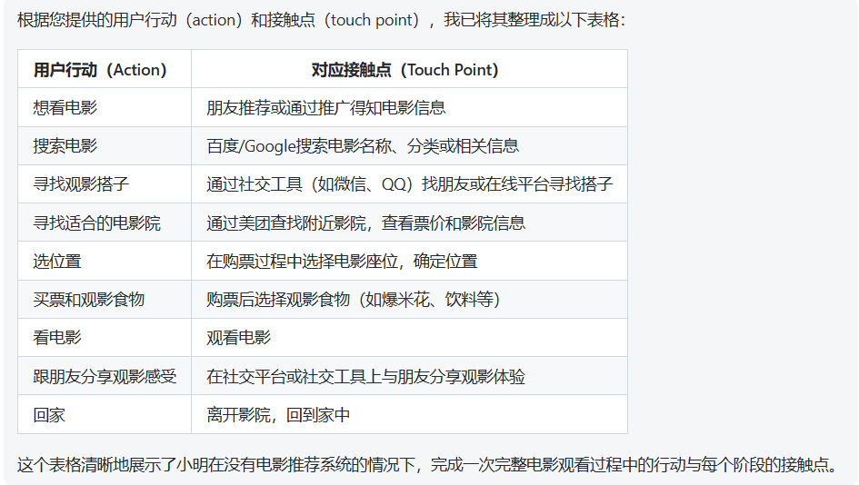

## 没有电影汪系统前

### Prompt

没有这个电影系统前，用户观看电影的action：想看电影->search电影->寻找观影搭子->寻找适合的电影院->选位置->买票和观影食物->看电影->跟朋友分享观影感受->回家。 action对应的touch point：朋友推荐或者通过推广得知->百度/Google搜索->社交工具找搭子->通过美团查找附近影院以及票价进行对比->在买票时选位置->购票后再购买食物->看电影->回家。 根据上述提供的action和touch point生成对应表格

### UserJourney

## 有电影汪系统后

### Prompt

有电影汪系统后，用户观看电影的action：想看电影->search电影->寻找观影搭子->寻找适合的电影院->选位置->买票和观影食物->看电影->跟朋友分享观影感受->回家。 action对应的touch point：登录系统，系统会不定时主动推送上映电影信息->根据用户平时偏好进行推荐电影/用户手动选择偏好类型->配对广场寻找搭子/陪看店点陪看->根据距离、价格进行智能排序->智能推荐当前观影最佳位置->一键下单，可以使用优惠卷，价格更划算->观看电影->可以在论坛上发表自己的观影体验，也可以给自己的搭子评分->可以跟搭子一起去吃宵夜等额外活动，拓展自己的朋友圈。 根据上述提供的action和touch point生成对应表格。

### User Journey

